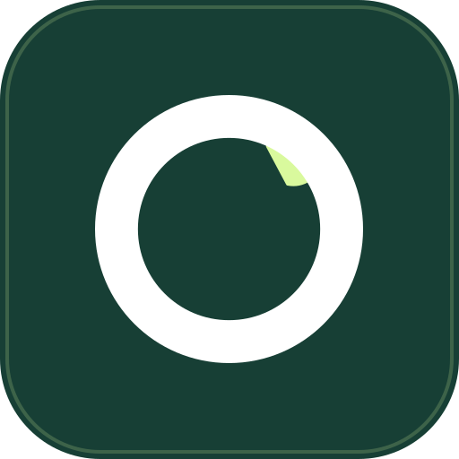

<div align="center">
  
  <h1>Quinzena — Controle Financeiro Quinzenal Inteligente</h1>
  <p><strong>A plataforma SaaS financeira desenhada para o fluxo de caixa quinzenal real, cognição leve (TDAH-friendly) e planejamento conjunto para casais.</strong></p>

  <p>
    <a href="https://quinzena.com.br" target="_blank"><strong>Acesse o Quinzena em Produção »</strong></a>
  </p>

  <p>
    
    
    
    
    
    
  </p>
</div>

---

## 💡 Sobre o Projeto

A esmagadora maioria dos aplicativos financeiros do mercado foi projetada exclusivamente para o ciclo mensal tradicional de 30 dias (do dia 1º ao dia 30/31). No Brasil, no entanto, uma parcela massiva de profissionais assalariados, autônomos e prestadores de serviço recebe seus rendimentos em **duas quinzenas** (adiantamento no dia 15/20 e saldo no dia 5).

Além disso, pessoas neurodivergentes (especialmente com **TDAH**) enfrentam enorme atrito com planilhas densas, excesso de inputs e interfaces burocráticas, o que leva à frustração e abandono rápido do controle orçamentário.

O **Quinzena** nasceu para resolver essa dor na raiz:
* **Fluxo Quinzenal Real:** Divisão matemática e visual entre a **1ª Quinzena (Q1)** e a **2ª Quinzena (Q2)**, com cálculo de cobertura de saldo dinâmico.
* **Cognição Leve & Foco Visual (TDAH Friendly):** Layout em Dark Mode com Glassmorphism, cards objetivos, alternância de status de pagamento em 1 clique e feedback sensorial tátil.
* **Planejamento Conjunto (Plano Duo):** Duas contas independentes conectadas sob o mesmo teto, com visualização de orçamentos compartilhados e individuais.
* **Privacidade e Desacoplamento Bancário:** Sem necessidade de conexão Open Finance invasiva. Controle total na mão do usuário.

---

## ✨ Principais Funcionalidades

### 🗓️ Gestão Quinzenal & Balanço Consolidado
- **Cálculo Global de Saldo:** Rendas fixas, rendas extras, gastos por quinzena e visualização instantânea de superávit ou déficit (`q1CobreQ2`).
- **Navegação Histórica:** Seletor de meses intuitivo com proteção de janela de retenção por plano.

### 🔁 Despesas Fixas (Recorrência com Auto-Cura)
- Propagação inteligente de despesas fixas para todos os ciclos futuros.
- **Rotina de Auto-Cura:** Recupera e reconecta automaticamente despesas legadas sem registros mestres órfãos.

### 💳 Compras Parceladas & Cartão de Crédito
- Lançamento inteligente com número de parcelas, quinzena de vencimento e cálculo automático de projeção nos meses subsequentes.

### 📑 Dossiê Financeiro em PDF & Exportação CSV
- **100% Client-Side:** Exportação completa de relatórios mensais e **Dossiê Anual Consolidado** gerados diretamente no navegador do usuário, com **zero custo de processamento em servidor ou consumo de storage**.

### 👩‍❤️‍👨 Modo Casal / Duo
- Código de convite seguro com expiração de 48h para pareamento de contas.
- Orçamento conjunto consolidado com separação transparente dos lançamentos de cada parceiro.

### ⚙️ Painel de Governança Administrativa (SaaS Admin)
- Métricas globais executivas em tempo real: Total de Usuários, Base Free, Base Paga, Taxa de Conversão e **MRR Estimado (Receita Recorrente Mensal)**.
- Gestão de papéis (RBAC - Admin / Usuário) e alteração manual de planos.
- **Integração Asaas:** Teste de conectividade sem CORS via backend, gerador de tokens seguros de Webhook e prevenção contra fila pausada.
- **Exclusão Definitiva em Cascata (Art. 18 LGPD):** Limpeza atômica de todos os dados do usuário, desvinculação de parceiro Duo e exclusão no Firebase Authentication.

### 📱 PWA & Anúncios Responsivos
- Aplicativo Web Progressivo (PWA) instalável no desktop e mobile, com suporte offline para assets estáticos.
- Integração Google AdSense no plano Free (com alternância responsiva entre banners laterais em telas grandes e banner horizontal acima das quinzenas em mobile/tablet).
- **Proteção Total Pro/Duo:** Usuários assinantes são 100% blindados de qualquer script de anúncio.

---

## 💎 Planos do SaaS

| Recurso / Benefício | Free (Gratuito) | Pro Individual | Duo (Casal) |
| :--- | :---: | :---: | :---: |
| **Valor** | **R$ 0,00** | **R$ 9,90/mês** | **R$ 19,90/mês** |
| **Histórico Ativo** | 3 meses (+ 1 mês de graça) | 12 meses (+ 1 mês de graça) | 12 meses (+ 1 mês de graça) |
| **Compras Parceladas** | Até 3 simultâneas | Ilimitadas | Ilimitadas |
| **Despesas Recorrentes** | Até 3 ativas | Ilimitadas | Ilimitadas |
| **Tributos e Viagens** | 1 ativo de cada | Ilimitados | Ilimitados |
| **Contas Conectadas** | 1 individual | 1 individual | **2 contas pareadas** |
| **Dossiê Anual em PDF** | Não incluso | Incluso | Incluso (Conjunto) |
| **Anúncios** | Exibidos | **100% Livre de Anúncios** | **100% Livre de Anúncios** |

---

## 🤖 Engenharia com Agent Harness

Este software foi integralmente concebido e evoluído utilizando um **Agentic Software Engineering Harness** sob a orquestração do Google DeepMind Antigravity, operando em conjunto com o protocolo de governança documentado no [`AGENTS.md`](./AGENTS.md).

### Como o Harness Funciona na Prática:
1. **Governança Multi-Papel:** O harness encarna personas técnicas com responsabilidades estritas:
   - **PM:** Contexto de negócio, criação de issues e estimativa de quotas no Firebase.
   - **PO:** Regras financeiras e cenários formais em **BDD (Gherkin)**.
   - **SEC:** Segurança, regras do Firestore, isolamento multitenant e prevenção a *Denial of Wallet*.
   - **UX:** Design tokens, Glassmorphism, SCSS modular e acessibilidade.
   - **DEV:** Implementação em TypeScript rigoroso, Signals e OnPush.
   - **QA:** Automação de testes e garantia de 100% de cobertura dos cenários BDD.
   - **Cost Guardian:** Vigilância contínua contra desperdício de quotas no Firebase Blaze.
2. **Ciclo Fechado de Verificação (*Verification Loop*):** Nenhuma alteração é promovida sem a execução bem-sucedida de toda a esteira de testes automatizados (623 testes de frontend + 51 de backend) e build otimizado de produção.
3. **Memória de Longo Prazo:** Gestão de decisões e contexto preservada na pasta de memórias estruturadas do projeto.
4. **Trava de Deploy em Produção:** Regra mandatória de segurança que exige autorização humana explícita antes de qualquer publicação.

---

## 🛠️ Stack Tecnológica

### Frontend
- **Framework:** [Angular 22.1](https://angular.dev/) (Standalone Components, Signals, `inject()`, `ChangeDetectionStrategy.OnPush`)
- **Estilização:** SCSS Modular, Design Tokens, Glassmorphism e CSS Grid/Flexbox fluido
- **Gerenciamento de Estado:** Signal Stores dedicadas (`AuthStore`, `FinanceStore`)
- **PWA:** Service Worker customizado com cache e manifesto de instalação nativo
- **Testes Unitários:** [Vitest](https://vitest.dev/) com jsdom (623 testes automatizados)

### Backend & Nuvem (Serverless)
- **Functions:** [Firebase Cloud Functions v2](https://firebase.google.com/docs/functions) (Node.js 20, Cloud Run, região `us-central1`)
- **Banco de Dados:** [Cloud Firestore](https://firebase.google.com/docs/firestore) com regras de segurança atômicas e isolamento por UID
- **Autenticação:** [Firebase Authentication](https://firebase.google.com/docs/auth) (Google OAuth e E-mail/Senha com RBAC)
- **Hospedagem & CDN:** [Firebase Hosting](https://firebase.google.com/docs/hosting) com Content Security Policy (CSP) rigorosa

### Pagamentos & Faturamento
- **Gateway:** [Asaas v3 API](https://docs.asaas.com/) (Assinaturas recorrentes via PIX Dinâmico com QR Code oficial e Cartão de Crédito com Webhooks idempotentes)

---

## 🔒 Segurança e Privacidade (SEC)

- **Isolamento Multitenant:** Nenhuma coleção de dados financeiros permite listagem global ou acesso cruzado entre usuários (`request.auth.uid == userId`).
- **Prevenção contra Elevação de Privilégios:** Mudanças de plano e concessão de privilégios de administrador só podem ser executadas pelas Cloud Functions autenticadas via Firebase Admin SDK.
- **Fail-Closed nos Webhooks (CWE-306):** Qualquer requisição de webhook externa sem token de validação idêntico ao esperado é rejeitada com `401 Unauthorized`.
- **Headers de Proteção Avançados:** Proteção contra clickjacking (`X-Frame-Options: SAMEORIGIN`), sniffing de MIME (`X-Content-Type-Options: nosniff`) e CSP restrita a origens autorizadas.
- **Conformidade LGPD:** Mecanismo completo de exclusão atômica de contas e subcoleções sob demanda.

---

## 🚀 Como Executar Localmente

### Pré-requisitos
- [Node.js](https://nodejs.org/) (versão 20 ou superior)
- [npm](https://www.npmjs.com/) (versão 10 ou superior)
- [Firebase CLI](https://firebase.google.com/docs/cli) (`npm install -g firebase-tools`)

### 1. Clonar o Repositório
```bash
git clone https://github.com/PhilipeEfrain/controle-gastos-angular.git
cd controle-gastos-angular
```

### 2. Instalar Dependências
```bash
# Dependências do Frontend
npm install

# Dependências do Backend (Cloud Functions)
npm --prefix functions install
```

### 3. Executar Servidor de Desenvolvimento
```bash
npm start
# ou: ng serve
```
Acesse a aplicação em: `http://localhost:4200`

### 4. Executar Testes Automatizados
```bash
# Rodar todos os testes unitários do Frontend (Vitest)
npm test

# Rodar todos os testes unitários do Backend (Cloud Functions)
npm --prefix functions test
```

### 5. Compilar Build de Produção
```bash
# Build do Frontend
npm run build

# Build do Backend
npm --prefix functions run build
```

---

## 📁 Estrutura de Diretórios

```
controle-gastos-angular/
├── public/                       # Assets públicos, manifesto PWA, robots, ads.txt
├── functions/                    # Backend Serverless (Firebase Cloud Functions v2)
│   ├── src/
│   │   ├── admin.ts              # Ações administrativas (exclusão LGPD, teste Asaas)
│   │   ├── cleanup.ts            # Rotina de retenção e expurgo de dados antigos
│   │   ├── feedback.ts           # Despacho de feedbacks para bot do Telegram
│   │   ├── payment.ts            # Criação de assinaturas PIX e Cartão via Asaas
│   │   ├── webhook-handler.ts    # Processamento seguro e idempotente de webhooks
│   │   └── index.ts              # Registro oficial das funções na nuvem
│   └── package.json
├── src/
│   ├── app/
│   │   ├── core/                 # Serviços centrais, guards, interceptors, stores e utils
│   │   │   ├── guards/           # AuthGuard, AdminGuard, PublicGuard
│   │   │   ├── models/           # Tipagens financeiras, usuário, planos e BDD
│   │   │   ├── services/         # ExpenseService, AsaasService, ExportService, etc.
│   │   │   ├── state/            # AuthStore e FinanceStore (Signals)
│   │   │   └── utils/            # Cálculos financeiros oficiais e formatadores BRL
│   │   ├── features/             # Módulos e páginas da aplicação
│   │   │   ├── admin/            # Painel Executivo do SaaS e governança
│   │   │   ├── auth/             # Login, Cadastro, Recuperação de Senha
│   │   │   ├── dashboard/        # Dashboard Quinzenal principal e modais
│   │   │   ├── installments/     # Gestão de Compras Parceladas
│   │   │   ├── landing/          # Landing Page institucional e de conversão
│   │   │   ├── settings/         # Configurações do perfil e plano Duo
│   │   │   ├── taxes/            # Gestão de Tributos Anuais
│   │   │   └── travel/           # Planejamento de Viagens
│   │   └── shared/               # Componentes reutilizáveis (cards, badges, modais, ads)
│   ├── environments/             # Configurações de ambiente (Dev e Produção)
│   └── styles/                   # Design Tokens, SCSS global e Glassmorphism
├── AGENTS.md                     # Protocolo oficial do time de agentes e fluxo Kanban
├── firebase.json                 # Configurações do Firebase Hosting, Functions e CSP
├── firestore.rules               # Regras de segurança do Cloud Firestore
└── README.md                     # Documentação oficial do repositório
```

---

## 📄 Licença e Direitos

Projeto desenvolvido e mantido por **Philipe Efrain**.  
Todos os direitos reservados. © 2026 Quinzena.
